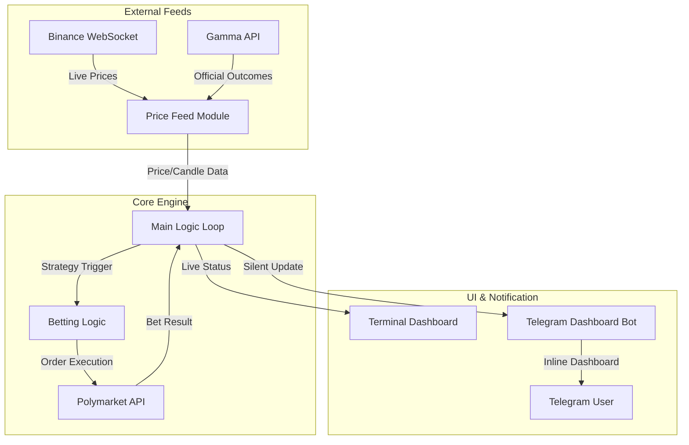
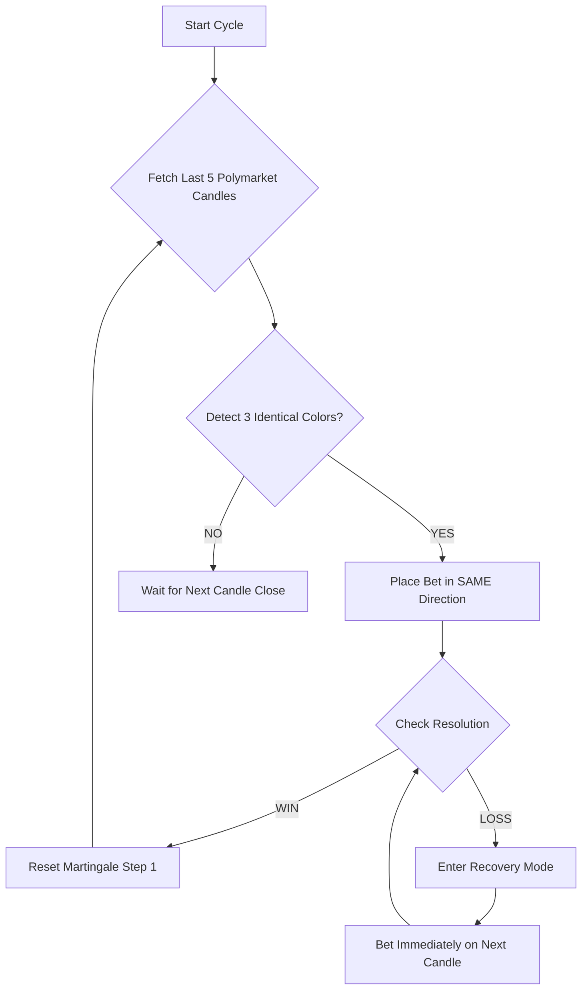

# 🤖 Polymarket VIP Bot — A High-Frequency Trading Bot (ogbot-v3)

A premium, automated trading bot designed for **Polymarket's 5/15-minute price prediction markets**. Featuring a sophisticated **3-Candle Trend Strategy**, a robust **Martingale Recovery System**, and a state-of-the-art **Zero-Notification Telegram Dashboard**.

---

## 🏗️ System Architecture



---

## 📊 Strategy: 3-Candle TREND Pattern

The bot follows an official market outcome trend strategy to minimize noise and maximize resolution accuracy.

### 🧩 Logic Flow


### 🗝️ Key Mechanism
- **The Pattern**: If candles are `GREEN-GREEN-GREEN`, the bot bets **UP** on the next.
- **Martingale**: Upon a loss, the bot increases the stake according to the table (default 7 steps) and bets in the same direction on the very next candle.
- **Data Source**: Uses official Polymarket outcomes (Yes/No) from the Gamma API to ensure local trends match official payouts.

---

## 💰 Betting Style & Martingale Amounts

The bot uses a disciplined Martingale system to recover from individual losses. If a bet loses, the bot doubles the previous amount on the next candle to ensure a single win covers all previous losses in that sequence.

### 📈 Martingale Progression Table
Based on your current `BASE_BET` of **$2.00**, here are the exact amounts the bot will wager at each step:

| Step | Bet Amount | Cumulative Risk |
| :--- | :--- | :--- |
| **Step 1** | **$2.00** | $2.00 |
| **Step 2** | **$6.00** | $8.00 |
| **Step 3** | **$14.00** | $22.00 |
| **Step 4** | **$30.00** | $52.00 |
| **Step 5** | **$62.00** | $114.00 |
| **Step 6** | **$126.00** | $240.00 |
| **Step 7** | **$254.00** | $494.00 |

> [!TIP]
> You can adjust the starting amount with the telegram command `/setbet [amount]` or change the max steps with `/setstop [steps]`.

---

## 🎯 How the Bot Makes Decisions (UP/DOWN)

The bot follows the **3-Candle Pattern** strategy. It analyzes the last 5 settled results from Polymarket and looks for a trend signature.

### 🟢 Trend Following (Default)
The bot assumes that if a coin has moved in one direction for 3 consecutive intervals, it will likely continue that trend on the 4th interval.

- **Sequence**: `UP -> UP -> UP` (3 Green)
- **Action**: Bot bets **UP** on the next market.

- **Sequence**: `DOWN -> DOWN -> DOWN` (3 Red)
- **Action**: Bot bets **DOWN** on the next market.

### 🔴 Reversal (Optional)
If you switch `STRATEGY_TYPE` to `"reversal"` in `config.py`, the bot will bet *against* the 3-candle trend (expecting a pullback).

---

## ✨ Features

- **👑 VIP Premium Terminal**: A sleek, auto-updating rich text interface for real-time monitoring.
- **🔇 Zero-Notification Dashboard**: No chat spam. The bot uses a single, dynamic message in Telegram that edits itself in real-time.
- **🔄 Auto-Sync**: Automatically fetches and displays the last 5 official Polymarket candle results.
- **🛡️ Crash Recovery**: Automatic restart wrapper to maintain uptime during network blips.
- **⚙️ Dynamic Control**: Change bot modes (Auto/Manual), toggle coins, and reset steps via Telegram inline buttons.

---

## 🚀 Setup & Installation

### 1. Prerequisites
- Python 3.10+
- Polymarket API Keys (API Key, Secret, Passphrase, and Proxy Wallet PK)
- Telegram Bot Token & User ID

### 2. Installation
```powershell
# Clone the repository
git clone https://github.com/satyamsk05/ogbot-v3.git
cd ogbot-v3

# Create & Activate Virtual Environment
python -m venv .venv
.\.venv\Scripts\Activate

# Install Dependencies
pip install -r requirements.txt
```

### 3. Configuration
Rename `.env.example` to `.env` and fill in your credentials:
```env
TELEGRAM_TOKEN=...
TELEGRAM_USER_ID=...
POLYMARKET_API_KEY=...
# ... other polymarket keys
```

---

## 🎮 Usage

### Start the Bot
```powershell
python main.py
```

### Telegram Commands
- `/start` - Launch the interactive Inline Dashboard.
- `/reset` - Global reset of all Martingale steps.
- `/bet ETH UP` - Place a manual bet.
- `/mode auto/manual` - Switch strategy execution mode.

### Inline Dashboard Buttons
- **🟢 START/STOP**: Toggle the automated strategy.
- **🔄 REFRESH**: Instantly pull latest prices and candle trends.
- **⚡ MARTINGALE RESET**: Reset recovery steps to 1 for all coins.
- **📊 HISTORY**: View last 5 bet outcomes.

---

## 📂 File Structure

| File | Description |
| :--- | :--- |
| `main.py` | Primary entry point. Manages dashboards and the main strategy loop. |
| `telegram_bot.py` | Handles the silent Inline Dashboard and user commands. |
| `price_feed.py` | Fetches live prices from Binance and historical outcomes from Polymarket. |
| `betting.py` | Core order placement logic and Martingale state management. |
| `config.py` | Centalized settings for strategy, coins, and risk limits. |
| `market_finder.py` | Dynamically discovers active price markets on Polymarket. |

---

> [!IMPORTANT]
> This bot is for educational purposes. Trading involves risk. Ensure your `.env` file is never shared or committed to public repositories.
